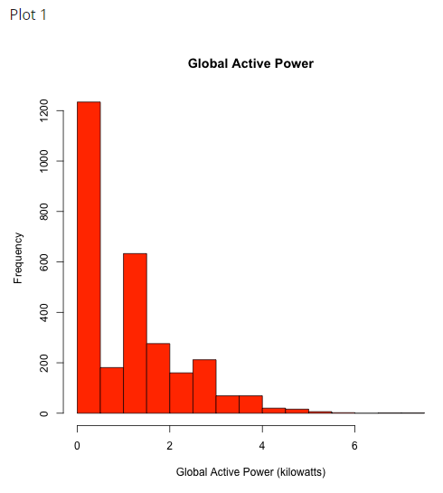
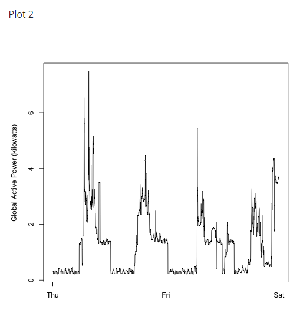
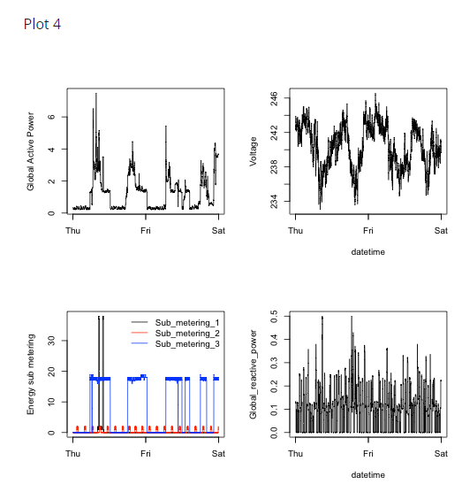

```{r setup, include=FALSE}
knitr::opts_chunk$set(echo = TRUE)
```

## Instrucciones 

This assignment uses data from the [UC Irvine Machine Learning Repository](https://archive.ics.uci.edu/ml/index.php), a popular repository for machine learning datasets. In particular, we will be using the “Individual household electric power consumption Data Set” which I have made available on the course web site:

- **Dataset**: [Electric power consumption](https://d396qusza40orc.cloudfront.net/exdata%2Fdata%2Fhousehold_power_consumption.zip) [20Mb]
- **Description**: Measurements of electric power consumption in one household with a one-minute sampling rate over a period of almost 4 years. Different electrical quantities and some sub-metering values are available.


The following descriptions of the 9 variables in the dataset are taken from the [UCI web site](https://archive.ics.uci.edu/ml/datasets/Individual+household+electric+power+consumption):

1. **Date**: Date in format dd/mm/yyyy
2. **Time**: time in format hh:mm:ss
3. **Global_active_power**: household global minute-averaged active power (in kilowatt)
4. **Global_reactive_power**: household global minute-averaged reactive power (in kilowatt)
5. **Voltage**: minute-averaged voltage (in volt)
6. **Global_intensity**: household global minute-averaged current intensity (in ampere)
7. **Sub_metering_1**: energy sub-metering No. 1 (in watt-hour of active energy). It corresponds to the kitchen, containing mainly a dishwasher, an oven and a microwave (hot plates are not electric but gas powered).
8. **Sub_metering_2**: energy sub-metering No. 2 (in watt-hour of active energy). It corresponds to the laundry room, containing a washing-machine, a tumble-drier, a refrigerator and a light.
9. **Sub_metering_3**: energy sub-metering No. 3 (in watt-hour of active energy). It corresponds to an electric water-heater and an air-conditioner.


## Loading the data
When loading the dataset into R, please consider the following:

- The dataset has 2,075,259 rows and 9 columns. First calculate a rough estimate of how much memory the dataset will require in memory before reading into R. Make sure your computer has enough memory (most modern computers should be fine).
- We will only be using data from the dates 2007-02-01 and 2007-02-02. One alternative is to read the data from just those dates rather than reading in the entire dataset and subsetting to those dates.
- You may find it useful to convert the Date and Time variables to Date/Time classes in R using the **strptime()**  and **as.Date()** functions.
- Note that in this dataset missing values are coded as **?**.

## Making Plots
Our overall goal here is simply to examine how household energy usage varies over a 2-day period in February, 2007. Your task is to reconstruct the following plots below, all of which were constructed using the base plotting system.

First you will need to fork and clone the following GitHub repository: https://github.com/rdpeng/ExData_Plotting1

For each plot you should

- Construct the plot and save it to a PNG file with a width of 480 pixels and a height of 480 pixels.
- Name each of the plot files as **plot1.png, plot2.png**, etc.
- Create a separate R code file (**plot1.R, plot2.R**, etc.) that constructs the corresponding plot, i.e. code in **plot1.R** constructs the **plot1.png** plot. Your code file should include code for reading the data so that the plot can be fully reproduced. You must also include the code that creates the PNG file.
- Add the PNG file and R code file to the top-level folder of your git repository (no need for separate sub-folders)

When you are finished with the assignment, push your git repository to GitHub so that the GitHub version of your repository is up to date. There should be four PNG files and four R code files, a total of eight files in the top-level folder of the repo.

The four plots that you will need to construct are shown below.









## Finished Project: 
[Link](https://github.com/IsaiasGutierrezCruz/ExData_Plotting1/tree/ProjectFinished)

### Plot 1
```{r}
# download and read the data 
dir.create("Data")
url <- "https://d396qusza40orc.cloudfront.net/exdata%2Fdata%2Fhousehold_power_consumption.zip"
download.file(url = url, destfile = "Data/ElectricPowerConsumption.zip", mode = 'wb')

setwd("Data")
unzip(zipfile = "ElectricPowerConsumption.zip")
setwd ("..")

data <- read.table("Data/household_power_consumption.txt", sep = ";", header = TRUE, na.strings = '?')

# select only the data from 2007-02-01 and 2007-02-02
data$Date <- as.Date(data$Date, format = "%d/%m/%Y")
data <- data[(data$Date >= "2007-02-01") & (data$Date <= "2007-02-02"), ]

# convert the variable Global active power to data type numeric
data$Global_active_power <- as.numeric(data$Global_active_power)

hist(data$Global_active_power, col = "red", main = "Global Active Power", 
     xlab = "Global Active Power (kilowatts)")

```

### Plot 2
```{r}
data <- read.table("Data/household_power_consumption.txt", sep = ";", header = TRUE, na.strings = '?')

# select only the data from 2007-02-01 and 2007-02-02
data$DateTime <- as.POSIXct(paste(data$Date, data$Time), format = "%d/%m/%Y %H:%M:%S")
data <- data[(data$DateTime >= "2007-02-01") & (data$DateTime < "2007-02-03"), ]


# convert the variable Global active power to data type numeric
data$Global_active_power <- as.numeric(data$Global_active_power)


plot(x = data$DateTime, y = data$Global_active_power, pch = ".", xlab = ""
     , ylab = "Global Active Power (kilowatts)")
lines(data$DateTime, data$Global_active_power)
```

### Plot 3
```{r}
data <- read.table("Data/household_power_consumption.txt", sep = ";", header = TRUE, na.strings = '?')

# select only the data from 2007-02-01 and 2007-02-02
data$DateTime <- as.POSIXct(paste(data$Date, data$Time), format = "%d/%m/%Y %H:%M:%S")
data <- data[(data$DateTime >= "2007-02-01") & (data$DateTime < "2007-02-03"), ]


plot(x = data$DateTime, y = data$Sub_metering_1, pch = ".", xlab = "", 
     ylab = "Energy sub metering")
lines(x = data$DateTime, y = data$Sub_metering_1, col = "black")
lines(x = data$DateTime, y = data$Sub_metering_2, col = "red")
lines(x = data$DateTime, y = data$Sub_metering_3, col = "blue")
legend("topright", col = c("black", "red", "blue"), lty = c(1, 1), 
       legend = c("Sub_metering_1", "Sub_metering_2", "Sub_metering_3"))
```


### Plot 4
```{r}
data <- read.table("Data/household_power_consumption.txt", sep = ";", header = TRUE, na.strings = '?')

# select only the data from 2007-02-01 and 2007-02-02
data$DateTime <- as.POSIXct(paste(data$Date, data$Time), format = "%d/%m/%Y %H:%M:%S")
data <- data[(data$DateTime >= "2007-02-01") & (data$DateTime < "2007-02-03"), ]


# set the number of plots per row 
par(mfrow = c(2, 2), mar = c(4, 4, 2, 1))
# plot 1
plot(x = data$DateTime, y = data$Global_active_power, pch = ".", xlab = ""
     , ylab = "Global Active Power (kilowatts)")
lines(data$DateTime, data$Global_active_power)

# plot 2
plot(x = data$DateTime, y = data$Voltage, pch = ".", xlab = "datetime"
     , ylab = "Voltage")
lines(data$DateTime, data$Voltage)

# plot 3
plot(x = data$DateTime, y = data$Sub_metering_1, pch = ".", xlab = "", 
     ylab = "Energy sub metering")
lines(x = data$DateTime, y = data$Sub_metering_1, col = "black")
lines(x = data$DateTime, y = data$Sub_metering_2, col = "red")
lines(x = data$DateTime, y = data$Sub_metering_3, col = "blue")
legend("topright", col = c("black", "red", "blue"), lty = c(1, 1), 
       legend = c("Sub_metering_1", "Sub_metering_2", "Sub_metering_3"), bty = "n", cex = .5)

# plot 4

plot(x = data$DateTime, y = data$Global_reactive_power, pch = ".", xlab = "datetime"
     , ylab = "Global Reactive Power")
lines(data$DateTime, data$Global_reactive_power)
```

