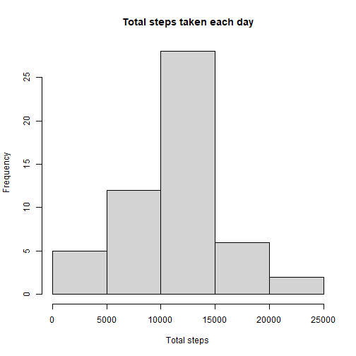
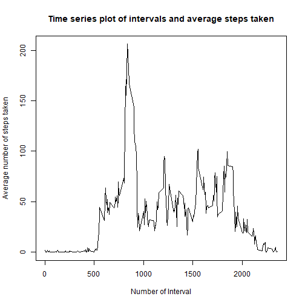
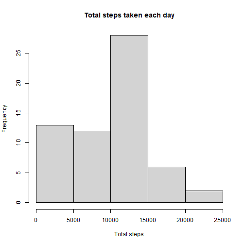
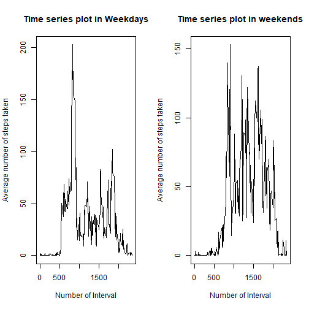

## Loading and preprocessing the data

```r
setwd("Data")
if(!file.exists('activity.csv')){
  unzip("activity.zip", exdir = getwd())
}

data <- read.csv("activity.csv")
setwd("..")

data$date <- ymd(data$date)
```


## What is mean total number of steps taken per day?
### Total number of steps taken per day

```r
total_stepsperDay <- data %>% group_by(date) %>% summarize(total_number = sum(steps))
total_stepsperDay
```

```
## # A tibble: 61 x 2
##    date       total_number
##    <date>            <int>
##  1 2012-10-01           NA
##  2 2012-10-02          126
##  3 2012-10-03        11352
##  4 2012-10-04        12116
##  5 2012-10-05        13294
##  6 2012-10-06        15420
##  7 2012-10-07        11015
##  8 2012-10-08           NA
##  9 2012-10-09        12811
## 10 2012-10-10         9900
## # ... with 51 more rows
```

### Make a histogram of the total number of steps taken each day

```r
hist(total_stepsperDay$total_number, main = "Total steps taken each day", xlab = "Total steps")
```


### Calculate and report the mean and median of the total number of steps taken per day

```r
# mean 
mean(total_stepsperDay$total_number, na.rm = TRUE)
```

```
## [1] 10766.19
```

```r
# median
median(total_stepsperDay$total_number, na.rm = TRUE)
```

```
## [1] 10765
```

## What is the average daily activity pattern?

```r
averageSteps_per_interval <- data %>% group_by(interval) %>% 
  summarize(average_steps = mean(steps, na.rm = TRUE))
plot(unique(data$interval), averageSteps_per_interval$average_steps, type = "l",
     main = "Time series plot of intervals and average steps taken",
     ylab = "Average number of steps taken",
     xlab = "Number of Interval")
```


### Which 5-minute interval, on average across all the days in the dataset, contains the maximum number of steps?

```r
averageSteps_per_interval[averageSteps_per_interval$average_steps == max(averageSteps_per_interval$average_steps), ]
```

```
## # A tibble: 1 x 2
##   interval average_steps
##      <int>         <dbl>
## 1      835          206.
```

## Imputing missing values
### Calculate and report the total number of missing values in the dataset (i.e. the total number of rows with NAs

```r
length(which(is.na(data$steps)))
```

```
## [1] 2304
```
### Devise a strategy for filling in all of the missing values in the dataset. The strategy does not need to be sophisticated. For example, you could use the mean/median for that day, or the mean for that 5-minute interval, etc.

```r
dataWithoutNA <- data
dataWithoutNA$steps[is.na(dataWithoutNA$steps)] <- 0
```

### Make a histogram of the total number of steps taken each day and Calculate and report the mean and median total number of steps taken per day. 

Do these values differ from the estimates from the first part of the assignment? What is the impact of imputing missing data on the estimates of the total daily number of steps?

```r
total_stepsperDayWithoutNA <- dataWithoutNA %>% group_by(date) %>% summarize(total_number = sum(steps))

hist(total_stepsperDayWithoutNA$total_number, main = "Total steps taken each day", xlab = "Total steps")
```



```r
# mean 
mean(total_stepsperDayWithoutNA$total_number, na.rm = TRUE)
```

```
## [1] 9354.23
```

```r
# median
median(total_stepsperDayWithoutNA$total_number, na.rm = TRUE)
```

```
## [1] 10395
```

Do these values differ from the estimates from the first part of the assignment? What is the impact of imputing missing data on the estimates of the total daily number of steps?
Yes, they do. The frequencies where were the NA values increased. And the median and mean descressed. 

## Are there differences in activity patterns between weekdays and weekends?

### Create a new factor variable in the dataset with two levels – “weekday” and “weekend” indicating whether a given date is a weekday or weekend day.

```r
dataWithoutNA <- dataWithoutNA %>% mutate(typeOfDay = ifelse(weekdays(date) == "domingo" | weekdays(date) == "sábado", 
                                            "weekend", "weekday"))
```

### Make a panel plot containing a time series plot (i.e. type = "l") of the 5-minute interval (x-axis) and the average number of steps taken, averaged across all weekday days or weekend days (y-axis).

```r
averageSteps_per_intervalWeekdays <- dataWithoutNA %>% 
  filter(typeOfDay == "weekday") %>% group_by(interval) %>% 
  summarize(average_steps = mean(steps))

averageSteps_per_intervalWeekends <- dataWithoutNA %>% 
  filter(typeOfDay == "weekend") %>% group_by(interval) %>% 
  summarize(average_steps = mean(steps))

par(mfrow = c(1, 2))
plot(unique(dataWithoutNA$interval), 
     averageSteps_per_intervalWeekdays$average_steps, 
     type = "l",
     main = "Time series plot in Weekdays",
     ylab = "Average number of steps taken",
     xlab = "Number of Interval")

plot(unique(dataWithoutNA$interval), 
     averageSteps_per_intervalWeekends$average_steps, 
     type = "l",
     main = "Time series plot in weekends",
     ylab = "Average number of steps taken",
     xlab = "Number of Interval")
```



